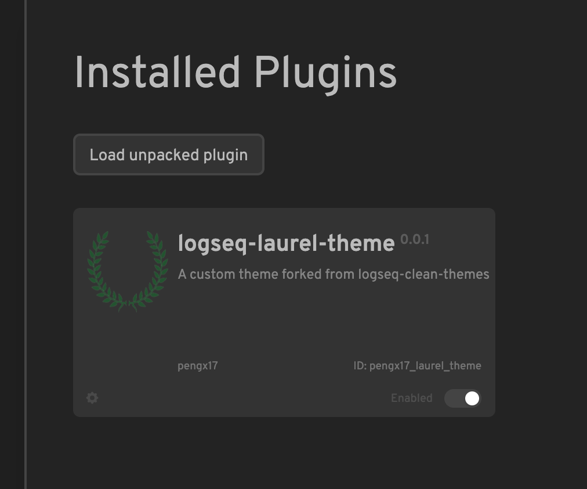
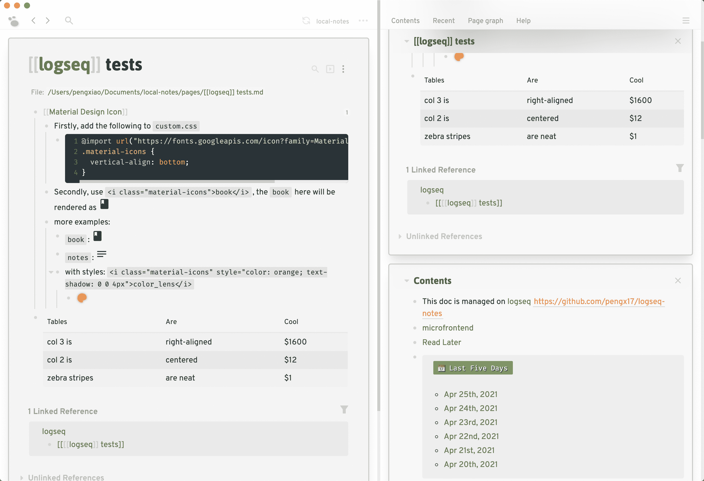
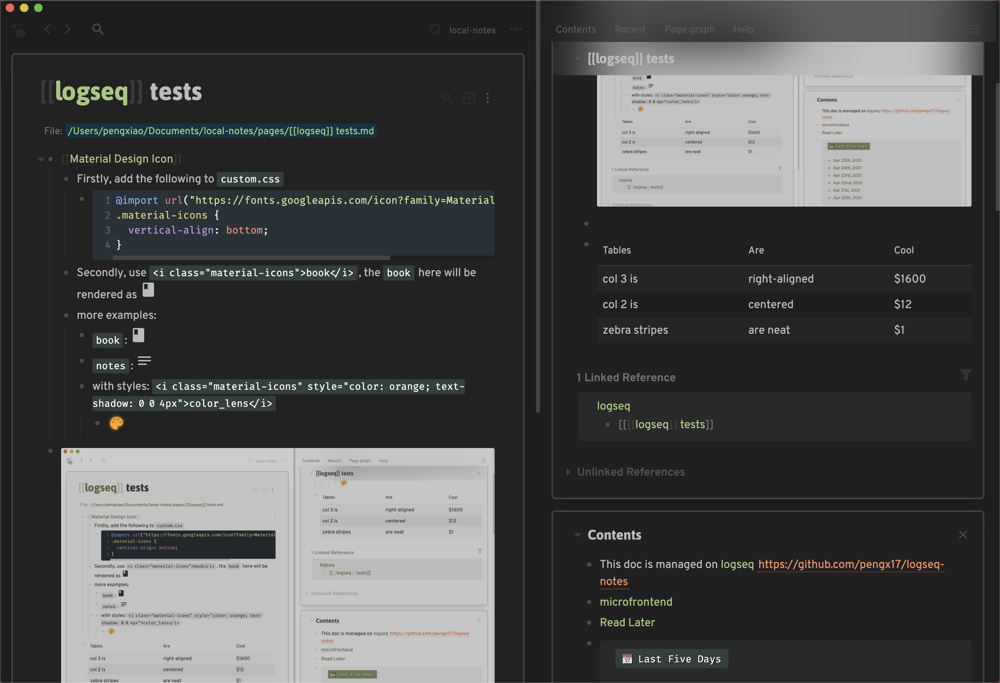

# Logseq Laurel Theme

My [Logseq](https://logseq.com) theme based on the work of @PiotrSss's [clean-themes](https://github.com/PiotrSss/logseq-clean-themes).


## Demo
Visit: https://logseq-laurel-theme.vercel.app/#/page/logseq%20laurel%20theme

## Features

- Sticky side bar headers with blur effects
- CodeMirror theme
- Contents in card-style layouts
- Vintage style query header tags
- Page preview style enhancements
- and many small enhancements/tweaks

The easiest way to adopt this theme is to use jsDelivr CDN.

1. Specify `:custom-css-url` in "logseq/config.edn"
2. Add the following line to your `custom.css`:
  ```css
  @import url('https://cdn.jsdelivr.net/gh/pengx17/logseq-laurel-theme@master/custom.css');
  ```

Alternatively once Logseq shipped plugins integration, you may also install this theme as a Logseq Plugin.



# Screenshots



